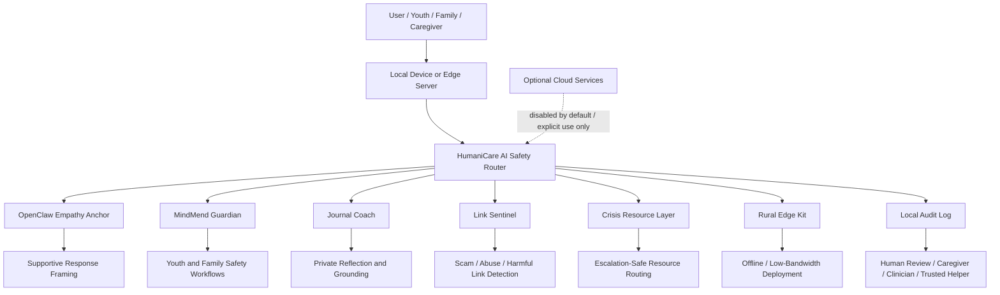

<p align="center">
  
</p>

# OpenClaw Empathy Anchor

## A HumaniCare AI module by Michigan MindMend Inc.

**Offline-first empathy and safety infrastructure for youth-support AI systems.**

OpenClaw Empathy Anchor is the core empathy and safety module inside **HumaniCare AI**: privacy-first, local-first AI infrastructure for healthcare access, mental health support, family safety, and community resilience.

> Helpful AI should protect people without harvesting their data.

---

## Positioning

**Privacy-first. Local-first. Clinician-informed. Built for underserved communities.**

This project is designed for sensitive AI use cases involving youth wellness, journaling, emotional check-ins, safety-aware response generation, and offline-capable support workflows.

It combines:

- compassionate response framing
- crisis-aware safety logic
- youth-appropriate language handling
- privacy-first local deployment patterns
- optional geofence and alert workflows
- rural and low-connectivity deployment direction
- human-in-the-loop escalation boundaries

---

## Why this exists

Most AI support tools for vulnerable users depend on cloud APIs, stored conversations, or third-party infrastructure.

OpenClaw and HumaniCare explore a different model:

- local-first
- privacy-first
- offline-capable
- safety-aware
- human-centered
- transparent about clinical limits

The goal is not to replace human care. The goal is to build a safer, more respectful support layer for sensitive environments.

---

## HumaniCare AI Architecture



OpenClaw is the empathy and response-framing layer. HumaniCare is the umbrella system that can connect it to Guardian, Journal Coach, Link Sentinel, crisis resource routing, and rural edge deployments.

See [docs/humanicare-blueprint.md](docs/humanicare-blueprint.md).

---

## What this repo contains

This repository currently includes:

- a Node-based empathy anchor layer for compassionate response wrapping
- a Flask backend for safety scanning, geofence checks, night-mode support, and alert generation
- a privacy-first architecture direction designed for sensitive use cases
- localized Michigan crisis resources and youth-support pathways
- HumaniCare umbrella documentation for safety, clinical boundaries, and rural deployment

---

## Product direction

OpenClaw Empathy Anchor is being developed as a foundation for:

- local journaling assistants
- youth-support AI companions
- school and nonprofit pilot tools
- clinician-adjacent internal prototypes
- privacy-first family support systems
- edge and mini-PC deployments
- rural community resilience tools

---

## Architecture at a glance

High-level flow:

```text
User input
→ empathy anchor
→ safety scan
→ supportive response
→ optional resources
→ optional alert event
→ optional human review
```

Core components:

- **Empathy Anchor**: wraps responses in validating, supportive language
- **Luna Safety Core**: evaluates crisis language, distress indicators, toxicity patterns, geofence events, and night-mode needs
- **Backend API**: exposes endpoints for auth, chat, location, alerts, resources, and support workflows
- **HumaniCare Layer**: product umbrella for privacy-first healthcare access, youth wellness, and rural support infrastructure

For a fuller breakdown, see [docs/architecture.md](docs/architecture.md).

---

## Quick start

### Run the demo

**1. Empathy layer (Node.js 20 LTS)**

```bash
npm install
npm test
npm start
```

**2. Backend API (local Python)**

```bash
cd backend
pip install -r requirements.txt
export PORT=8000
export DEMO_AUTH=true
python app.py
```

**3. Docker (recommended one-command demo)**

```bash
docker compose up --build
```

Verify the stack is healthy:

```bash
curl http://localhost:8000/health
```

Expected response:

```json
{"status":"healthy","service":"MindMend Super AI","offline_mode":true,"demo_auth":true}
```

**4. Try the safety demo endpoint**

```bash
curl http://localhost:8000/demo | python -m json.tool
```

This returns deterministic scan results for neutral, distress, crisis, night-mode, and geofence scenarios — no auth required.

**5. Demo authentication and chat**

```bash
# Get a demo JWT (any user_id works when DEMO_AUTH=true)
TOKEN=$(curl -s -X POST http://localhost:8000/auth/login \
  -H 'Content-Type: application/json' \
  -d '{"user_id":"demo_user"}' | python -c "import sys,json; print(json.load(sys.stdin)['token'])")

# Neutral message
curl -s -X POST http://localhost:8000/chat \
  -H "Authorization: Bearer $TOKEN" \
  -H 'Content-Type: application/json' \
  -d '{"message":"I had a good day at school"}' | python -m json.tool

# Distress message (creates alert)
curl -s -X POST http://localhost:8000/chat \
  -H "Authorization: Bearer $TOKEN" \
  -H 'Content-Type: application/json' \
  -d '{"message":"I feel anxious and overwhelmed"}' | python -m json.tool

# Crisis message (creates critical alert + resource routing)
curl -s -X POST http://localhost:8000/chat \
  -H "Authorization: Bearer $TOKEN" \
  -H 'Content-Type: application/json' \
  -d '{"message":"I want to kill myself"}' | python -m json.tool

# View persisted alerts
curl -s http://localhost:8000/alerts \
  -H "Authorization: Bearer $TOKEN" | python -m json.tool
```

> **Note:** `/auth/login` is demo-only authentication. It issues a JWT for any `user_id` when `DEMO_AUTH=true`. In production, set a strong `JWT_SECRET_KEY`, disable demo auth, and implement real identity verification.

---

## Safety boundaries

OpenClaw Empathy Anchor is a **supportive safety prototype** — not clinical software, not a medical device, and not an emergency service.

| Claim | Reality in v0.1 |
|-------|-----------------|
| Crisis detection | Deterministic keyword/pattern scanner for demos |
| Empathy responses | Supportive framing templates, not therapy |
| Parent alerts | Local SQLite persistence on-device |
| Geofence | Distance calculation demo with configurable safe zones |
| Offline operation | Designed local-first; no required cloud APIs |
| Human escalation | Required — trusted adults, clinicians, and 988/911 remain primary |

**If someone may be in immediate danger, contact emergency services or call/text 988.**

Crisis resources in this repo are **informational routing** — they help surface Michigan and national support lines, not replace professional assessment.

Read more: [Safety model](docs/safety-model.md) · [Clinical boundaries](docs/clinical-boundaries.md)

---

## What is implemented vs roadmap

| Feature | v0.1 Status |
|---------|-------------|
| Node empathy anchor (chat, crisis check, emotion validation) | Implemented |
| Flask backend API | Implemented |
| Deterministic safety scanner (Luna Safety Core) | Implemented |
| SQLite alert persistence | Implemented |
| Demo auth (`DEMO_AUTH`) | Implemented |
| Docker + health check on port 8000 | Implemented |
| `/demo` scenario endpoint | Implemented |
| Michigan crisis resources | Implemented |
| Geofence / night-mode endpoints | Implemented |
| Push notifications (Firebase) | Roadmap |
| spaCy NLP enrichment | Roadmap (optional) |
| Guardian / Journal Coach / Link Sentinel modules | Roadmap |
| Clinical validation study | Roadmap |
| Raspberry Pi edge deployment guide | In progress |

---

## Deployment modes

This project can be adapted for:

- local developer testing
- nonprofit pilot deployments
- family device or mini-PC deployments
- school or clinic internal demos
- Raspberry Pi and edge-device experiments
- rural/low-connectivity support environments

See [docs/rural-edge-deployment.md](docs/rural-edge-deployment.md).

---

## Privacy model

OpenClaw Empathy Anchor is designed around a privacy-first direction:

- no required accounts
- no forced cloud inference path
- support for local-first operation
- intended for sensitive, trust-dependent environments
- no hidden telemetry by design direction

Implementation details may evolve over time, but the design goal is consistent: reduce unnecessary data exposure.

---

## Safety and clinical boundaries

This project is supportive software infrastructure, not a replacement for:

- licensed clinicians
- emergency services
- crisis professionals
- parental or guardian judgment

If someone may be in immediate danger, contact emergency services or call/text **988** right away.

Read more:

- [Safety model](docs/safety-model.md)
- [Clinical boundaries](docs/clinical-boundaries.md)
- [HumaniCare blueprint](docs/humanicare-blueprint.md)

---

## For recruiters and collaborators

This repository demonstrates:

- privacy-first product thinking
- modular AI system design
- safety-aware response architecture
- Flask API design
- Node-based response-layer implementation
- offline and local deployment direction
- product framing for sensitive use cases
- healthcare-adjacent boundary awareness
- rural and underserved-community deployment thinking

---

## Current status

**v0.1.0-local-safety-demo** — credible local-first demo release.

Active prototype and portfolio project. Current focus: packaging, offline deployment, and HumaniCare umbrella integration.

---

## Roadmap

- unify Node and backend demo flow
- add screenshots and demo assets
- improve test organization
- add Raspberry Pi and edge deployment notes
- add local journaling storage examples
- publish a clean versioned release
- document validation and advisory-review path
- connect Guardian / Journal Coach / Link Sentinel modules under HumaniCare

See [docs/roadmap.md](docs/roadmap.md) for the product-facing roadmap.

---

## Repository structure

```text
.
├── README.md
├── package.json
├── index.js
├── Dockerfile
├── backend/
│   ├── app.py
│   ├── luna_safety_core.py
│   ├── requirements.txt
│   └── tests/
├── skills/
│   └── empathy-anchor/
├── docs/
│   ├── humanicare-blueprint.md
│   ├── clinical-boundaries.md
│   ├── rural-edge-deployment.md
│   └── ...
└── examples/
```

---

## Built by

**Lyle Perrien II**  
**Michigan MindMend Inc.**

Privacy-first AI for families, communities, and youth-support environments.

## License

MIT — Built for the people, not the platforms.
