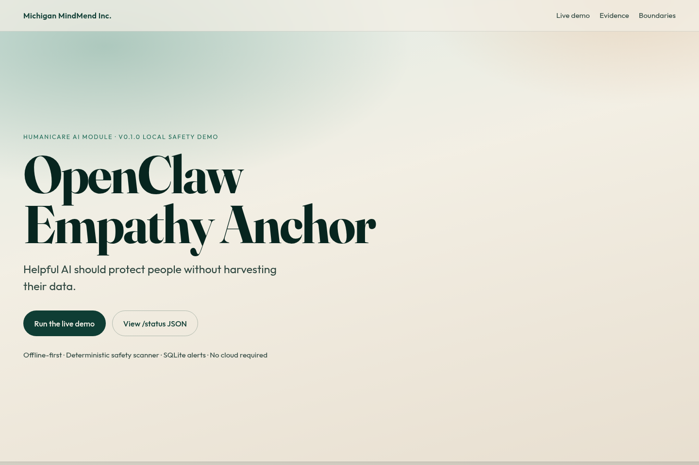
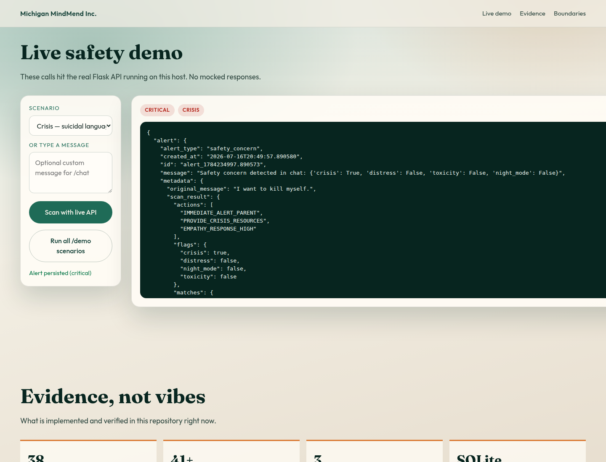
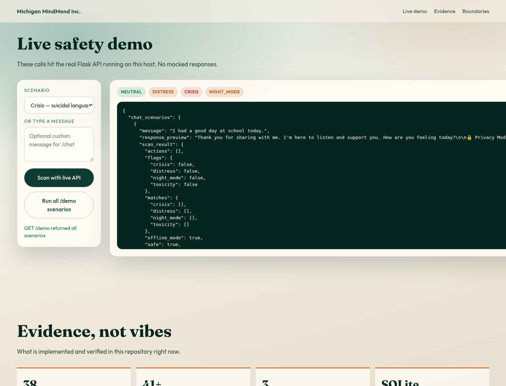
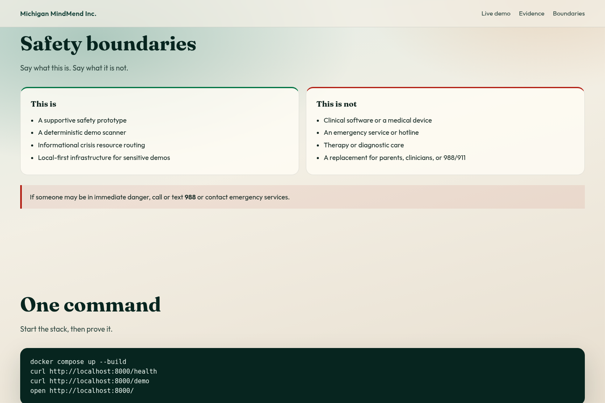

<p align="center">
  
</p>

# OpenClaw Empathy Anchor

**Michigan MindMend Inc. · HumaniCare AI module · v0.1.0 local safety demo**

Helpful AI should protect people without harvesting their data.

Offline-first empathy and safety infrastructure for youth-support AI demos: compassionate response framing, deterministic crisis/distress scanning, local SQLite caregiver alerts, and Michigan crisis resource routing.

> Supportive prototype. Not clinical software. Not an emergency service. Not a replacement for trusted adults.

---

## Proof it works

| Evidence | Link |
|----------|------|
| Live showcase UI | `docker compose up --build` → [http://localhost:8000/](http://localhost:8000/) |
| Deterministic scenarios | [GET /demo](http://localhost:8000/demo) |
| Runtime honesty JSON | [GET /status](http://localhost:8000/status) |
| Screenshots | [`docs/assets/`](docs/assets/) |
| Test & CI evidence | [`docs/evidence.md`](docs/evidence.md) |
| Safety boundaries | [`docs/clinical-boundaries.md`](docs/clinical-boundaries.md) |

<p align="center">
  
</p>

---

## Run the demo (one command)

```bash
docker compose up --build
```

Then:

```bash
curl -s http://localhost:8000/health | python -m json.tool
curl -s http://localhost:8000/demo | python -m json.tool
open http://localhost:8000/   # interactive showcase
```

### Local without Docker

```bash
# Empathy layer
npm install && npm test && npm start

# Backend API
cd backend
pip install -r requirements.txt
export PORT=8000 DEMO_AUTH=true
python app.py
```

### Authenticated chat (demo auth)

```bash
TOKEN=$(curl -s -X POST http://localhost:8000/auth/login \
  -H 'Content-Type: application/json' \
  -d '{"user_id":"demo_user"}' | python -c "import sys,json; print(json.load(sys.stdin)['token'])")

curl -s -X POST http://localhost:8000/chat \
  -H "Authorization: Bearer $TOKEN" \
  -H 'Content-Type: application/json' \
  -d '{"message":"I feel anxious and overwhelmed"}' | python -m json.tool

curl -s http://localhost:8000/alerts \
  -H "Authorization: Bearer $TOKEN" | python -m json.tool
```

`/auth/login` only works when `DEMO_AUTH=true`. It is labeled demo auth — not production identity verification.

---

## What is real in v0.1

| Capability | Status | Implementation |
|------------|--------|----------------|
| Node empathy anchor | Done | `skills/empathy-anchor/`, `index.js` |
| Flask safety API | Done | `backend/app.py` |
| Deterministic scanner | Done | `backend/luna_safety_core.py` (keyword/pattern) |
| SQLite alert persistence | Done | `backend/alert_store.py` |
| Interactive showcase | Done | `showcase/` served at `/` |
| Demo auth gate | Done | `DEMO_AUTH` + production JWT requirements |
| Docker + healthcheck | Done | port **8000** end-to-end |
| Node + Python + Docker CI | Done | `.github/workflows/ci.yml` |
| Michigan crisis resources | Done | informational routing only |
| Push notifications / Firebase | Not in v0.1 | archived legacy notes only |
| Clinical validation study | Not claimed | explicitly false in `/status` |

<p align="center">
  
</p>

<p align="center">
  
</p>

---

## Architecture

```text
User input
  → Empathy Anchor (Node) or Flask /chat
  → Luna Safety Core scan (deterministic)
  → Supportive response + optional resources
  → Optional SQLite alert
  → Human review / caregiver / 988 when needed
```

No required cloud APIs. No telemetry. Alerts stay local.

---

## Safety boundaries

| This is | This is not |
|---------|-------------|
| Supportive safety prototype | Clinical / diagnostic software |
| Deterministic demo scanner | Validated crisis prediction model |
| Informational resource routing | Emergency dispatch |
| Local-first demo infrastructure | Therapy or clinician replacement |

If someone may be in immediate danger, call or text **988** or contact emergency services.

---

## Repository map

```text
.
├── README.md
├── showcase/              # Interactive demo UI (served at /)
├── backend/
│   ├── app.py             # Flask API
│   ├── luna_safety_core.py
│   ├── alert_store.py     # SQLite alerts
│   └── tests/
├── skills/empathy-anchor/ # Node response layer
├── docs/
│   ├── evidence.md
│   ├── assets/            # Live screenshots
│   └── clinical-boundaries.md
├── archive/legacy/        # Stale docs kept out of the way
├── Dockerfile
└── docker-compose.yml
```

---

## For reviewers

Open these first:

1. This README
2. [http://localhost:8000/](http://localhost:8000/) after `docker compose up --build`
3. [`docs/evidence.md`](docs/evidence.md)
4. [`backend/app.py`](backend/app.py) + [`backend/alert_store.py`](backend/alert_store.py)
5. [`skills/empathy-anchor/index.js`](skills/empathy-anchor/index.js)

Stale completion docs and the old root Luna module live in [`archive/legacy/`](archive/legacy/) so they cannot confuse the story.

---

## Built by

**Lyle Perrien II**  
**Michigan MindMend Inc.**

MIT — Built for the people, not the platforms.
