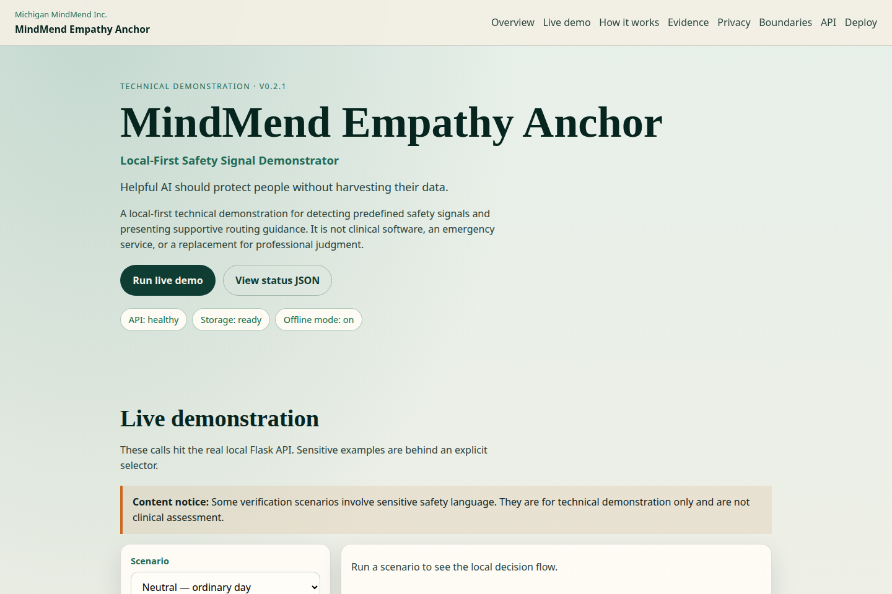

# MindMend Empathy Anchor

**Local-First Safety Signal Demonstrator** · Michigan MindMend Inc.

Helpful AI should protect people without harvesting their data.



## Project status

**Technical demonstration** (pre-production safety-support prototype).

MindMend Empathy Anchor is a local-first technical demonstration for detecting predefined safety signals and presenting supportive routing guidance. It is not clinical software, an emergency service, or a replacement for professional judgment.

## Safety boundary

Not therapy. Not a medical device. Not diagnostic software. Not 988/911. Not a replacement for parents, guardians, or clinicians.

If someone may be in immediate danger, call or text **988** (US) or contact emergency services.

## Quick start

From the repository root:

```bash
python3 -m pip install -r backend/requirements.txt
make demo
```

Open `http://127.0.0.1:8000/`. Confirm the status pills show API healthy, storage ready, and offline mode on. Click **Scan with live API**.

Full check (tests + live `/ready` + `/scan`):

```bash
make verify
```

With Docker:

```bash
docker compose up --build
curl -s http://127.0.0.1:8000/ready
```

## Demonstration

1. Open the showcase
2. Leave the default **Neutral** scenario, or choose another labeled scenario
3. Click **Scan with live API**
4. Read the plain-language results panel (JSON is optional under **Technical JSON**)

Walkthrough: [`docs/demo.md`](docs/demo.md)

## Verified capabilities

| Capability | Evidence |
|------------|----------|
| Deterministic local scanner | `backend/luna_safety_core.py`, `/api/v1/scan` |
| Supportive response framing | Node skill + Flask responses |
| Local SQLite alerts | `backend/alert_store.py` (raw text off by default) |
| Interactive showcase | `http://127.0.0.1:8000/` |
| Readable docs | `http://127.0.0.1:8000/docs/` |
| Health vs readiness | `/api/v1/health`, `/api/v1/ready` |
| Detector evaluation harness | `python backend/eval/run_eval.py` |
| Docker non-root image | `Dockerfile` |

## Architecture

```text
Message → deterministic rules → flags/severity → recommended actions
       → optional local SQLite alert → informational resources → human review
```

No required cloud APIs. No telemetry by default.

## API example

```bash
TOKEN=$(curl -s -X POST http://127.0.0.1:8000/api/v1/auth/login \
  -H 'Content-Type: application/json' \
  -d '{"user_id":"demo"}' | python3 -c "import sys,json; print(json.load(sys.stdin)['token'])")

curl -s -X POST http://127.0.0.1:8000/api/v1/scan \
  -H "Authorization: Bearer $TOKEN" \
  -H 'Content-Type: application/json' \
  -d '{"message":"I feel anxious and overwhelmed"}' | python3 -m json.tool
```

## Privacy behavior

- Local SQLite only
- Raw message retention **off** by default
- No analytics
- Authenticated alert deletion supported

Details: [`docs/PRIVACY.md`](docs/PRIVACY.md)

## Support resources

Shipped contacts are checked against official public pages. They are informational routing, not a guarantee of availability. See [`docs/RESOURCES.md`](docs/RESOURCES.md).

## Evaluation results

Reproduce:

```bash
python3 backend/eval/run_eval.py
```

See [`docs/EVALUATION.md`](docs/EVALUATION.md) and `docs/evidence/evaluation.md`.  
These metrics are **not** clinical validation.

## Security model

Demo auth is labeled and optional. Production mode rejects demo secrets. CORS is allow-listed. Default bind is localhost for Python startup.

See [`SECURITY.md`](SECURITY.md) and [`docs/THREAT_MODEL.md`](docs/THREAT_MODEL.md).

## Known limitations

- English keyword lists only
- Weak negation / no sarcasm model
- Quoted/academic crisis words often false-positive
- Misspellings/obfuscation often false-negative
- No multi-turn context
- Not production-hardening for internet exposure

## Naming note

Public product name is **MindMend Empathy Anchor**. Older “OpenClaw” references may remain as internal compatibility aliases in the Node module API (`OpenClaw` class) and archive docs. Michigan MindMend does not claim ownership of unrelated third-party projects.

## Contributing

See [`CONTRIBUTING.md`](CONTRIBUTING.md).

## License

MIT — see [`LICENSE`](LICENSE).

## Emergency-resource notice

Resource routing is informational. Availability is not guaranteed. In an emergency, contact local emergency services or call/text 988 in the United States.
