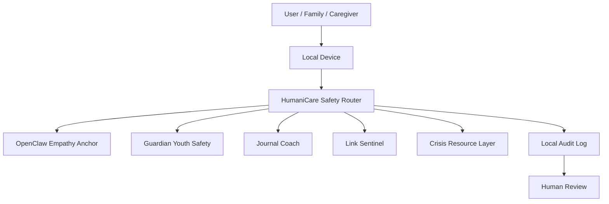

# HumaniCare AI Blueprint

**Open-source AI infrastructure for healthcare access, mental health support, and community resilience.**

HumaniCare AI is the umbrella architecture for Michigan MindMend Inc.'s privacy-first support tools. OpenClaw Empathy Anchor becomes one core module inside that wider system.

## Core idea

Most AI support tools are cloud-first. They ask families, students, patients, and vulnerable people to send private thoughts, crisis signals, voice data, and safety concerns into third-party infrastructure.

HumaniCare flips that model:

- local-first by default
- cloud optional, never required
- no hidden telemetry
- no ad targeting
- no secret data harvesting
- human-in-the-loop for high-risk moments
- clear clinical boundaries

> Helpful AI should protect people without harvesting their data.

## Umbrella architecture

## Modules

| Module | Purpose |
|---|---|
| OpenClaw Empathy Anchor | Supportive response framing, youth-aware language, emotional grounding |
| Guardian | Family and youth safety assistant |
| Journal Coach | Private reflection and grounding support |
| Link Sentinel | Harmful-link, scam, coercion, and abuse-pattern detection |
| Crisis Resource Layer | Local resource routing and escalation-safe language |
| Rural Edge Kit | Offline-first deployment pattern for homes, schools, nonprofits, and clinics |

## Product stance

HumaniCare AI is not trying to replace doctors, therapists, emergency responders, parents, or trusted humans.

It is support infrastructure:

- it helps organize safer responses
- it routes risk to human support
- it protects privacy
- it works in low-connectivity environments
- it keeps sensitive data closer to the person who owns it

## Best public positioning

Use:

> Privacy-first. Local-first. Clinician-informed. Built for underserved communities.

Avoid overclaiming:

- Do not say clinically validated unless validation exists.
- Do not say HIPAA compliant unless a formal compliance program exists.
- Do not claim diagnosis, treatment, or emergency replacement.

## Build path

1. Clean repo structure
2. Local demo flow
3. Safety router tests
4. Crisis/resource boundary docs
5. Offline deployment guide
6. Evidence log
7. Clinician/advisor review
8. Community pilot documentation
