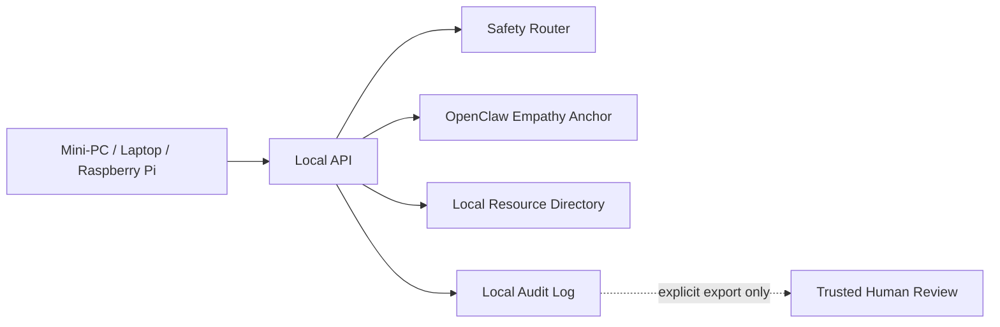

# Rural Edge Deployment

HumaniCare AI is designed for places where cloud-only tools are not enough.

## Target environments

- rural homes
- small schools
- nonprofits
- community centers
- local clinics
- caregiver devices
- mini-PC or Raspberry Pi deployments

## Deployment model

## Default privacy posture

- No forced account
- No hidden telemetry
- No advertising identifiers
- No silent cloud upload
- No cloud dependency for core support flow

## Why it matters

Rural and underserved communities often face:

- weak internet
- limited access to care
- long travel times
- privacy concerns
- fewer local support options

Local-first AI support infrastructure can help fill gaps without turning sensitive family data into platform data.

## Production hardening checklist

- encrypted local storage
- access controls
- retention policy
- caregiver/clinician review mode
- tamper-evident logs
- offline resource directory
- clear emergency disclaimers
- tested backup/export process
